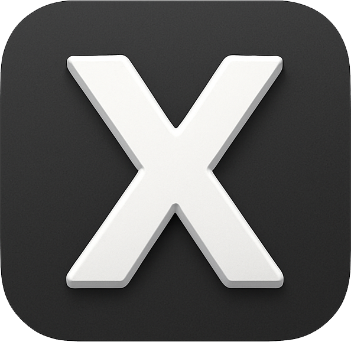
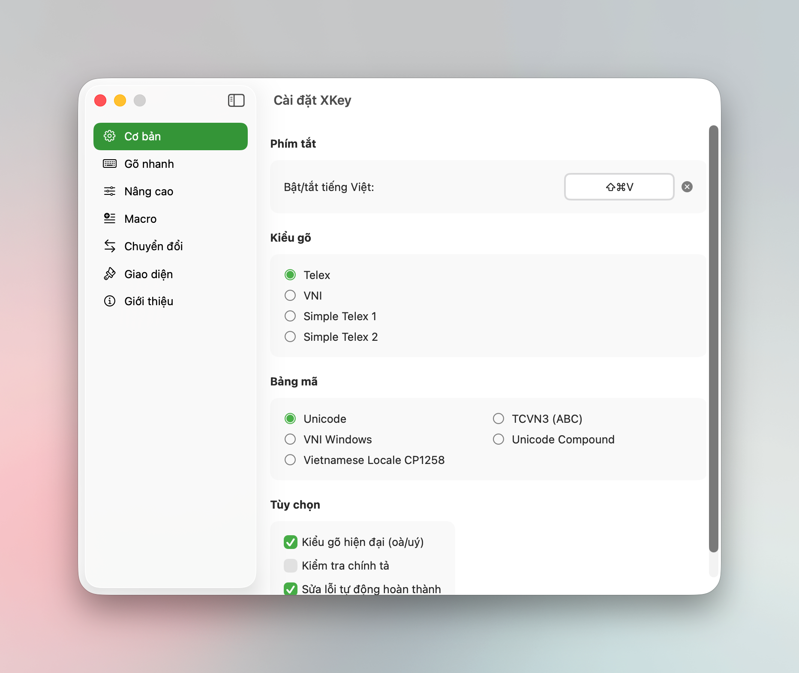

# XKey

<div align="center">
  

  **Modern Vietnamese input method for macOS**

  [](https://github.com/xmannv/xkey/releases)
  [](https://formulae.brew.sh/cask/xkey)
  [](https://www.apple.com/macos/)
  [](LICENSE)
</div>

---

#### (Chọn ngôn ngữ dưới đây / Choose your language below)
[](README.md)
[](README.en.md)

---

## Introduction

### Why XKey?

Existing Vietnamese input methods on macOS often suffer from:

- Poor compatibility with the latest macOS releases
- Unfixed bugs and infrequent maintenance
- Missing modern features, and being hard to debug or customize

XKey is built to address these problems.

### Highlights

- High performance: written entirely in native Swift, optimized for macOS
- Good compatibility with recent macOS versions (12.0+)
- Stable, frequently updated, with built-in auto-update
- A Debug Window to observe the engine's behavior in real time
- Smart features: Smart Switch, Macro, Quick Typing, spell checking, personal dictionary
- Fast translation via hotkeys, supporting 30+ languages across multiple providers (Google, Tencent, Volcano)
- A modern SwiftUI interface
- Runs fully locally, with no user data collection
- Dual operating modes: CGEvent and Input Method Kit (XKeyIM)

---

## Core Features

<div align="center">
  
</div>

### 1. Two operating modes

| Mode | Description | Advantage |
|------|-------------|-----------|
| **CGEvent** (default) | Uses CGEvent injection | No configuration needed, works with every app |
| **XKeyIM** (experimental) | Uses Input Method Kit | Smoother in Terminal, Spotlight, Address Bar |

### 2. Multiple typing methods

| Method | Description | Example |
|--------|-------------|---------|
| **Auto-detect** | Automatically detects Telex or VNI while typing | — |
| **Telex** | The most common method | `tieengs` → tiếng |
| **VNI** | Traditional number-based method | `tie61ng` → tiếng |
| **Simple Telex 1** | Simplified Telex (w unchanged) | `tieengs` → tiếng |
| **Simple Telex 2** | Telex + w for ư/ơ | `tuaw` → tưa |

### 3. Character encodings

- **Unicode (UTF-8)** — recommended, default
- **TCVN3 (ABC)** — compatible with legacy software
- **VNI Windows** — compatible with VNI fonts

### 4. Quick Typing

Speed up typing with smart shortcuts.

| Feature | Behavior |
|---------|----------|
| **Quick Telex** | `cc`→`ch`, `gg`→`gi`, `kk`→`kh`, `nn`→`ng`, `pp`→`ph`, `qq`→`qu`, `tt`→`th` |
| **Quick Start Consonant** | `f`→`ph`, `j`→`gi`, `w`→`qu` (word start) |
| **Quick End Consonant** | `g`→`ng`, `h`→`nh`, `k`→`ch` (word end) |

### 5. Macro (text shortcuts)

Automatically expand text with Macros:

- Create custom abbreviations
- Import/export macro lists (.txt)
- Optional auto-capitalization for macros
- Optional trailing space after a macro
- Works even in English mode

### 6. Text conversion tools

Accessible via custom hotkeys.

| Feature | Description |
|---------|-------------|
| **Letter case** | UPPERCASE, lowercase, Capitalize first letter, Capitalize Each Word |
| **Encoding** | Convert between Unicode ↔ TCVN3 ↔ VNI |
| **Remove diacritics** | Convert accented text to plain text |

### 7. Spell checking (experimental)

- Uses a Vietnamese dictionary (~200KB, GPL license)
- Automatic recovery from misspellings
- Supports both new (xoà) and old (xóa) diacritic styles
- Personal dictionary: add your own words to skip checking
- Import/export the personal dictionary

### 8. Smart Switch

- Remembers the language per application
- Detects overlay apps such as Spotlight/Raycast/Alfred
- Automatically switches language when changing apps

### 9. Fast translation

Translate text inside any application via custom hotkeys. XKey offers two translation directions, each with its own hotkey and independently toggled options.

#### Translate to target language

Translate the selected text (or the whole field) from the source language to the target language.

Usage:
1. Select the text you want to translate in any app
2. Press the hotkey (default: `⌘ + ⇧ + T`)
3. The result is processed according to the enabled options

If no text is selected, XKey translates the entire content of the input field.

| Option | Default | Description |
|--------|---------|-------------|
| **Replace original text** | On | Replace the selected text with the translation |
| **Copy to clipboard** | On | Copy the translation to the clipboard |
| **Show popup** | Off | Display the translation in an overlay popup |
| **Auto-hide popup** | 4 seconds | Auto-hide delay (0 = never) |

#### Translate back to source language

Translate text back from the target language to the source language — useful for checking meaning or verifying a translation.

Usage:
1. Select the text to translate back
2. Press the hotkey (configure it in Settings)
3. The result is processed according to the enabled options

| Option | Default | Description |
|--------|---------|-------------|
| **Replace original text** | Off | Replace the selected text with the reverse translation |
| **Copy to clipboard** | Off | Copy the translation to the clipboard |
| **Show popup** | On | Display the translation in an overlay popup |
| **Auto-hide popup** | 4 seconds | Auto-hide delay (0 = never) |

Each option is fully independent — you may enable replacing text, copying to clipboard, and showing the popup at the same time.

#### Overlay popup

- Glassmorphism UI that follows Light/Dark mode automatically
- A button to quickly copy the translation to the clipboard
- Buttons to increase/decrease font size (+/−)
- Drag the header to move it, drag edges to resize
- Independent auto-hide delay per translation direction
- A countdown bar showing the remaining time

#### Supported languages

| Feature | Description |
|---------|-------------|
| **Auto-detection** | Detects the source language automatically |
| **Multilingual** | 30+ common languages (English, Vietnamese, Chinese, Japanese, Korean, French, German...) |
| **Custom language** | Enter an ISO 639-1 code to use any language |

#### Translation providers

| Provider | Description |
|----------|-------------|
| **Google Translate** | Free, multilingual, good quality |
| **Tencent Transmart** | Free, optimized for Asian languages |
| **Volcano Engine** | Free, high quality for Chinese ↔ Vietnamese |

You can enable/disable each provider and change their priority under **Settings → Translation**.

#### Advanced behavior

- Automatic fallback: if the preferred provider fails or returns empty, the next provider is tried automatically
- Clear error messages for each error type (network, rate limit, invalid result...)
- Preserves letter case (ALL CAPS, Capitalize, lowercase)
- A loading overlay showing translation progress at the cursor
- Smart text retrieval: Accessibility API with a Clipboard fallback

Configuration: **Settings → Translation**

### 10. Input source management

- View the list of all input sources
- Enable/disable XKey for specific input sources
- A hotkey to quickly switch between XKey/ABC
- Automatic detection of other Vietnamese input sources

### 11. Per-app engine tuning (Window Title Rules)

Detects special contexts based on window titles, solving Vietnamese typing issues in web apps.

| Web App | Special handling |
|---------|------------------|
| Google Docs/Sheets/Slides | Disable marked text, slow injection |
| Notion, Figma | Adjusted delays |
| And many other apps | Customizable as needed |

Window Title Rules features:
- Automatically recognizes web apps in any browser
- Applies the right handling per context
- Overrides injection method, delay, and text-sending method
- Automatically switches input source when a rule matches
- Supports Regex matching

Configuration: **Settings → Advanced → Per-app engine tuning**

#### Adding a new rule

1. Open **Settings → Advanced → Per-app engine tuning**
2. Click **"Add rule"**
3. Fill in the details:
   - **Name**: the display name of the rule
   - **Bundle ID**: `*` to apply to all apps, or pick a specific app
   - **Title Pattern**: a keyword to match in the window title
   - **Match mode**: Contains, Starts with, Ends with, Exact match, or Regex
4. Configure behavior (optional):
   - **Override Marked Text**: enable/disable underline while typing
   - **Override Injection Method**: Fast, Slow, Selection, Autocomplete, AX Direct, or Passthrough
   - **Custom Injection Delays**: delays (µs) for Backspace, Wait, Text
   - **Text sending method**: Chunked or One-by-One
   - **Switch Input Source**: automatically switch to a specific input source
5. Click **"Add"** to save

Note: If you use Google Docs/Sheets/Slides with a Vietnamese UI, the window titles appear as "Google Tài liệu", "Google Trang tính", "Google Trang trình bày". Add matching rules with the corresponding Title Pattern.

### 12. Other features

| Feature | Description |
|---------|-------------|
| **Undo typing** | A hotkey to undo diacritic placement (`tiếng` → `tieesng`) |
| **Free Mark** | Place diacritics anywhere in the word |
| **Modern diacritics** | Supports both new (oà/uý) and old (òa/úy) styles |
| **Smart temporary off** | Ctrl disables spell check, Option temporarily disables the engine |
| **Floating toolbar** | Quick XKey controls at the cursor position |
| **App exclusion** | Disable XKey for specific apps |
| **Auto-update** | Automatic updates via Sparkle |
| **Backup/Restore** | Back up and restore all settings |
| **Debug Window** | Observe the engine's activity in real time |

---

## Installation

### System requirements

- macOS 12.0 (Monterey) or later
- Accessibility permission

### Install via Homebrew (recommended)

XKey is available on [Homebrew Cask](https://formulae.brew.sh/cask/xkey). A single command:

```bash
brew install --cask xkey
```

Upgrade:

```bash
brew upgrade --cask xkey
```

Uninstall:

```bash
brew uninstall --cask xkey
```

After installing, you still need to grant Accessibility permission: **System Settings → Privacy & Security → Accessibility** → enable XKey.

### Install from a release

1. Download the latest `XKey.dmg` from [Releases](https://github.com/xmannv/xkey/releases)
2. Open the DMG and drag XKey.app into the Applications folder
3. Launch XKey from Applications
4. Grant Accessibility permission: **System Settings → Privacy & Security → Accessibility** → enable XKey

### Build from source

```bash
# Clone repository
git clone https://github.com/xmannv/xkey.git
cd xkey/XKey

# Build release
./build_release.sh

# Output: Release/XKey.app, Release/XKey.dmg
```

---

## XKeyIM — Input Method Kit Mode

XKeyIM is an input method built on Apple's IMKit, offering a smoother typing experience in apps with low response latency or autocomplete behavior such as Terminal, Spotlight, and the Address Bar.

### Bundle Identifiers

| Component | Bundle ID |
|-----------|-----------|
| XKey (main app) | `com.codetay.XKey` |
| XKeyIM (input method) | `com.codetay.inputmethod.XKey` |
| App Group | `group.com.codetay.xkey` |

### XKeyIM features

| Feature | Description |
|---------|-------------|
| **Marked Text Mode** | Shows an underline while typing — stable and compatible (recommended) |
| **Direct Mode** | No underline — may misbehave in some apps |
| **Undo key** | ESC to undo (e.g., "thử" → "thur") |
| **Quick toggle hotkey** | Customizable hotkey to toggle between XKey and ABC |

### Installing XKeyIM

1. Open XKey Settings → **Input Sources**
2. Click **"Install XKeyIM..."**
3. Copy `XKeyIM.app` into `~/Library/Input Methods/`
4. Log out and log back in
5. Open **System Settings → Keyboard → Input Sources**
6. Click **"+"** and add **"XKey Vietnamese"**

### Permissions for XKeyIM

XKeyIM needs **Accessibility** permission to handle certain special key combinations (such as Ctrl+C in Terminal):

1. Open **System Settings → Privacy & Security → Accessibility**
2. Click **"+"** and add `XKeyIM.app` from `~/Library/Input Methods/`
3. Enable XKeyIM

Without Accessibility permission, XKeyIM still types Vietnamese normally. The permission is only needed so shortcuts like Ctrl+C behave correctly while marked text is present.

Undo key: XKeyIM uses ESC as the default undo key (not customizable due to Input Method Kit limitations). Pressing ESC while typing an accented word reverts it to its plain form.

### Build XKeyIM from source

See detailed instructions: [XKeyIM/README.md](XKeyIM/README.md)

---

## Development

### Project structure

```
XKey/
├── Shared/               # Shared code between XKey and XKeyIM
│   ├── SharedSettings.swift
│   ├── AppBehaviorDetector.swift
│   ├── DebugLogger.swift
│   └── TranslationLanguage.swift
├── XKey/
│   ├── App/              # Entry point, AppDelegate
│   ├── Core/             # Core engine
│   │   ├── Engine/       # Vietnamese input engine (VNEngine.swift, etc.)
│   │   ├── Models/       # Data models (Preferences, VNCharacter, etc.)
│   │   └── Translation/  # Translation service with multiple providers
│   ├── EventHandling/    # Keyboard event handling, EventTap
│   ├── InputMethod/      # Input source management
│   ├── UI/               # SwiftUI views and settings sections
│   └── Utilities/        # Helper utilities
├── XKeyIM/               # Input Method Kit bundle
│   ├── Info.plist        # IMKit configuration
│   ├── main.swift        # Entry point
│   └── XKeyIMController.swift
├── XKeyTests/            # Unit tests
├── Release/              # Build output
└── build_release.sh      # Build script
```

### Build script

The `build_release.sh` script supports several options to customize the build process:

```bash
# with code signing + DMG (default)
./build_release.sh

# without code signing
ENABLE_CODESIGN=false ./build_release.sh

# without XKeyIM
ENABLE_XKEYIM=false ./build_release.sh

# Full release: Notarization + Auto GitHub Release
ENABLE_NOTARIZE=true ./build_release.sh

# create a GitHub Release automatically
ENABLE_GITHUB_RELEASE=true ./build_release.sh
```

#### Automatic GitHub Release

The script can create a GitHub Release automatically after a build finishes.

Requirements:
- GitHub CLI (`gh`) installed: `brew install gh`
- Logged in: `gh auth login`

Features:
- Reads the version from `Info.plist`
- Creates a `v{version}` tag and a GitHub release
- Uploads `XKey.dmg` and `signature.txt` (for Sparkle auto-update)
- Auto-generates release notes from git commits
- Triggers GitHub Actions to generate the appcast

Custom release notes: create a `.release_notes.md` file at the project root to use custom notes instead of auto-generation.

```bash
# Option 1: enable manually
ENABLE_GITHUB_RELEASE=true ./build_release.sh

# Option 2: automatic on notarize (full release)
ENABLE_NOTARIZE=true ./build_release.sh
```

### Technology stack

| Technology | Purpose |
|------------|---------|
| **Swift Native** | optimized for macOS |
| **SwiftUI** | modern user interface |
| **Input Method Kit** | Input method native (XKeyIM) |
| **Core Graphics Events** | keyboard event handling and injection |
| **Accessibility API** | focus detection with AXObserver |
| **Sparkle** | auto-update framework |

### Settings persistence

XKey uses a dual storage system so settings are never lost:

1. **Primary Storage**: App Group UserDefaults (`group.com.codetay.inputmethod.XKey`)
   - Shares settings between XKey and XKeyIM
   - Lets both apps sync settings in real time
2. **Backup Storage**: UserDefaults.standard
   - Automatically backs up whenever settings change
   - Automatically restores if the App Group container is reset

Benefits:
- Settings persist across version updates
- Automatic migration from older versions
- Safe backups
- Synchronization between XKey and XKeyIM

---

## Acknowledgements

XKey is built upon:

- **OpenKey**: an open-source Vietnamese input method
- **Unikey**: a popular Vietnamese input method

---

## License

This project is released under the MIT license. See the [LICENSE](LICENSE) file for details.

---

## Contact

- **Issues**: [GitHub Issues](https://github.com/xmannv/xkey/issues)
- **Discussions**: [GitHub Discussions](https://github.com/xmannv/xkey/discussions)

---

<div align="center">
  Made by XKey Contributors

  If you find it useful, please give the project a star.
</div>
