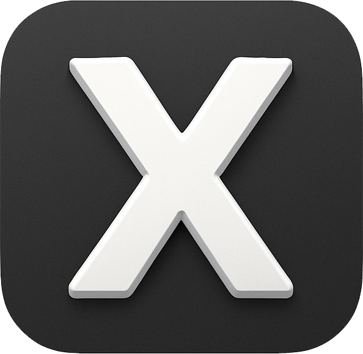
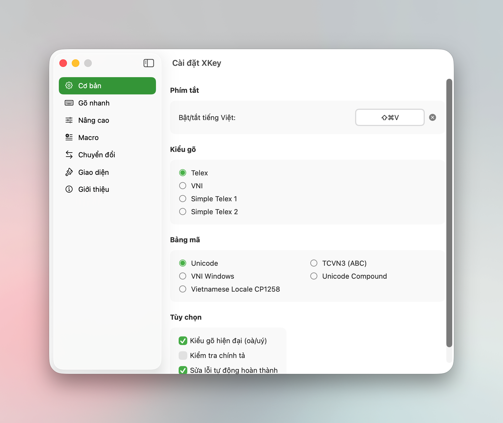

# XKey

<div align="center">
  
  
  **Bộ gõ tiếng Việt hiện đại cho macOS**
  
  [](https://github.com/xmannv/xkey/releases)
  [](https://www.apple.com/macos/)
  [](LICENSE)
</div>

---

## 📖 Giới thiệu

### 🎯 Tại sao XKey ra đời?

Các bộ gõ tiếng Việt hiện tại trên macOS đang gặp một số vấn đề:
- 🚫 **Không tương thích** với các phiên bản macOS mới nhất
- 🐛 **Nhiều bug** chưa được sửa, ít được tác giả cập nhật và bảo trì
- 🔧 **Thiếu tính năng** hiện đại, khó debug và tùy biến linh hoạt

**XKey** được tạo ra để giải quyết triệt để những vấn đề trên!

### ✨ Điểm nổi bật

- ⚡ **Hiệu suất vượt trội**: Viết hoàn toàn bằng **Swift native**, tối ưu hóa tối đa cho macOS, phản hồi tức thì
- 🎯 **Tương thích hoàn hảo**: Chạy mượt mà trên tất cả phiên bản macOS mới nhất
- 🔧 **Ổn định & Không bug**: Code base hiện đại, được test kỹ lưỡng, cập nhật thường xuyên
- 🛠️ **Debug Window**: Cửa sổ debug chuyên nghiệp giúp developer theo dõi real-time hoạt động của bộ gõ
- 🚀 **Tính năng thông minh**: Smart Switch, Macro, Quick Typing, kiểm tra chính tả
- 🎨 **Giao diện hiện đại**: Thiết kế theo phong cách Apple với SwiftUI
- 🔒 **Bảo mật**: Chạy local, không thu thập dữ liệu người dùng
- ⌨️ **IMKit Mode**: Hỗ trợ Input Method Kit cho trải nghiệm mượt mà trong Terminal và IDE

---

## 🎯 Tính năng chính

<div align="center">
  
</div>

### 1. Hai chế độ hoạt động

| Chế độ | Mô tả | Ưu điểm |
|--------|-------|---------|
| **CGEvent** (Mặc định) | Sử dụng CGEvent injection | Không cần cấu hình, hoạt động ngay |
| **IMKit** (Thử nghiệm) | Sử dụng Input Method Kit | Mượt mà hơn trong Terminal/IDE |

### 2. Hỗ trợ đa kiểu gõ

- **Telex**: Kiểu gõ phổ biến nhất (ví dụ: `tiếng` → tiếng)
- **VNI**: Kiểu gõ truyền thống (ví dụ: `tie61ng` → tiếng)
- **VIQR**: Kiểu gõ chuẩn quốc tế (ví dụ: `tie^'ng` → tiếng)

### 3. Bảng mã đa dạng

- Unicode (UTF-8) - Khuyến nghị
- TCVN3 (ABC)
- VNI Windows
- Unicode Compound

### 4. Gõ nhanh (Quick Typing)

Tăng tốc độ gõ với các phím tắt thông minh:

#### Quick Telex
- `cc` → `ch`, `gg` → `gi`, `kk` → `kh`
- `nn` → `ng`, `pp` → `ph`, `qq` → `qu`, `tt` → `th`

#### Quick Consonant - Đầu từ
- `f` → `ph`, `j` → `gi`, `w` → `qu`

#### Quick Consonant - Cuối từ
- `g` → `ng`, `h` → `nh`, `k` → `ch`

### 5. Macro (Text Shortcuts)

Tự động thay thế văn bản với Macro:
- Tạo các từ viết tắt tùy chỉnh
- Hỗ trợ import/export danh sách macro
- Tự động viết hoa macro

### 6. Công cụ chuyển đổi văn bản

- **Chữ hoa/thường**: Viết hoa tất cả, viết thường tất cả, viết hoa chữ đầu
- **Bảng mã**: Chuyển đổi giữa Unicode, TCVN3, VNI
- **Xóa dấu**: Chuyển từ có dấu sang không dấu

### 7. Tính năng nâng cao

- **Kiểm tra chính tả**: Tự động phát hiện và sửa lỗi
- **Smart Switch**: Nhớ ngôn ngữ theo từng ứng dụng
- **Tạm tắt thông minh**: Ctrl tắt chính tả, Option tắt bộ gõ
- **Debug Window**: Theo dõi real-time hoạt động của bộ gõ

### 8. Window Title Rules

Phát hiện ngữ cảnh đặc biệt dựa trên tiêu đề cửa sổ, giải quyết vấn đề gõ tiếng Việt trong các web apps:

| Web App | Xử lý đặc biệt |
|---------|----------------|
| Google Docs/Sheets/Slides | Tắt marked text, slow injection |
| Notion, Figma | Điều chỉnh delay phù hợp |

**Ưu điểm:**
- ✅ Tự động nhận diện web apps trong bất kỳ browser nào
- ✅ Áp dụng xử lý phù hợp cho từng context
- ✅ Có thể tùy chỉnh rules theo nhu cầu

**Cấu hình:** Settings → Nâng cao → Quy tắc theo Window Title

#### Hướng dẫn thêm quy tắc mới

1. Mở **Settings** → **Nâng cao** → **Quy tắc theo Window Title**
2. Nhấn **"Thêm quy tắc"**
3. Điền thông tin:
   - **Tên**: Tên hiển thị cho quy tắc (VD: "Safari Google Docs" hoặc "Safari Google Tài liệu")
   - **Bundle ID**: `*` để áp dụng cho tất cả apps, hoặc chọn app cụ thể (VD: "com.google.Safari")
   - **Title Pattern**: Từ khóa để nhận diện trong tiêu đề cửa sổ (VD: "Google Docs" hoặc "Google Tài liệu")
   - **Match mode**: Chọn cách so khớp (Chứa, Bắt đầu bằng, Kết thúc bằng, Khớp chính xác, Regex)
4. Cấu hình behavior (tùy chọn):
   - **Ghi đè Marked Text**: Bật/tắt gạch chân khi gõ
   - **Ghi đè Injection Method**: Chọn Fast, Slow, Selection, hoặc Autocomplete (VD: "Slow" cho Safari Google Docs)
   - **Tùy chỉnh Injection Delays**: Điều chỉnh delay (µs) cho Backspace, Wait, Text
   - **Phương thức gửi text**: Chọn Chunked hoặc One-by-One (VD: "One-by-One" cho Safari Google Docs)
5. Nhấn **"Thêm"** để lưu

> **💡 Lưu ý quan trọng:** Nếu bạn sử dụng Google Docs/Sheets/Slides với ngôn ngữ **tiếng Việt**, tiêu đề cửa sổ sẽ hiển thị là **"Google Tài liệu"**, **"Google Trang tính"**, **"Google Trang trình bày"** thay vì tên tiếng Anh. Bạn cần tạo thêm quy tắc với Title Pattern tương ứng:
>
> | Tên tiếng Anh | Tên tiếng Việt |
> |---------------|----------------|
> | Google Docs | Google Tài liệu |
> | Google Sheets | Google Trang tính |
> | Google Slides | Google Trang trình bày |

---

## 📥 Cài đặt

### Yêu cầu hệ thống

- macOS 12.0 (Monterey) trở lên
- Quyền truy cập Accessibility

### Cài đặt từ Release

1. Tải file `XKey.dmg` mới nhất từ [Releases](https://github.com/xmannv/xkey/releases)
2. Mở DMG và kéo XKey.app vào thư mục Applications
3. Mở XKey từ Applications
4. Cấp quyền Accessibility:
   - **System Settings** → **Privacy & Security** → **Accessibility**
   - Bật quyền cho XKey

### Build từ mã nguồn

```bash
# Clone repository
git clone https://github.com/xmannv/xkey.git
cd xkey/XKey

# Build release
./build_release.sh

# Output: Release/XKey.app, Release/XKey.dmg
```

---

## ⌨️ XKeyIM - Input Method Kit Mode

XKeyIM là Input Method sử dụng IMKit của Apple, cung cấp trải nghiệm gõ mượt mà hơn trong Terminal và IDE.

### Bundle Identifiers

| Component | Bundle ID |
|-----------|-----------|
| XKey (main app) | `com.codetay.XKey` |
| XKeyIM (input method) | `com.codetay.inputmethod.XKey` |
| App Group | `group.com.codetay.xkey` |

### Cài đặt XKeyIM

1. Mở XKey Settings → **Nâng cao**
2. Bật **"IMKit Mode"**
3. Click **"Cài đặt XKeyIM..."**
4. Copy `XKeyIM.app` vào `~/Library/Input Methods/`
5. Logout/Login lại
6. Mở **System Settings** → **Keyboard** → **Input Sources**
7. Click **"+"** và thêm **"XKey Vietnamese"**

### Quyền truy cập cho XKeyIM

XKeyIM cần quyền **Accessibility** để xử lý một số tổ hợp phím đặc biệt (như Ctrl+C trong Terminal):

1. Mở **System Settings** → **Privacy & Security** → **Accessibility**
2. Click **"+"** và thêm `XKeyIM.app` từ `~/Library/Input Methods/`
3. Bật quyền cho XKeyIM

> **Lưu ý:** Nếu không cấp quyền Accessibility, XKeyIM vẫn hoạt động bình thường cho việc gõ tiếng Việt. Quyền này chỉ cần thiết để đảm bảo các phím tắt như Ctrl+C hoạt động đúng khi đang có văn bản đang soạn (marked text).

### Build XKeyIM từ mã nguồn

Xem hướng dẫn chi tiết tại [XKeyIM/README.md](XKeyIM/README.md)

---

## 🛠️ Phát triển

### Cấu trúc dự án

```
XKey/
├── XKey/
│   ├── App/              # Entry point
│   ├── Core/             # Core engine
│   │   ├── Engine/       # Vietnamese input engine
│   │   └── Models/       # Data models
│   ├── EventHandling/    # Keyboard event handling
│   ├── UI/               # SwiftUI views
│   └── Utilities/        # Helper utilities
├── XKeyIM/               # Input Method Kit bundle
│   ├── Info.plist        # IMKit configuration
│   ├── main.swift        # Entry point
│   └── XKeyIMController.swift
├── XKeyTests/            # Unit tests
├── Release/              # Build output
└── build_release.sh      # Build script
```

### Build Script

Script `build_release.sh` hỗ trợ nhiều options để customize build process:

```bash
# Build với code signing + DMG (mặc định)
./build_release.sh

# Build không code signing
ENABLE_CODESIGN=false ./build_release.sh

# Build không XKeyIM
ENABLE_XKEYIM=false ./build_release.sh

# Full release: Notarization + Auto GitHub Release
ENABLE_NOTARIZE=true ./build_release.sh

# Tạo GitHub Release tự động
ENABLE_GITHUB_RELEASE=true ./build_release.sh
```

#### Tự động tạo GitHub Release

Script hỗ trợ tự động tạo GitHub Release khi build hoàn thành:

**Yêu cầu:**
- GitHub CLI (`gh`) đã cài đặt: `brew install gh`
- Đã đăng nhập: `gh auth login`

**Tính năng:**
- ✅ Tự động đọc version từ `Info.plist`
- ✅ Tạo tag `v{version}` và release trên GitHub
- ✅ Upload `XKey.dmg` và `signature.txt` (cho Sparkle auto-update)
- ✅ Tự động generate release notes từ git commits
- ✅ Trigger GitHub Actions để generate appcast

**Custom Release Notes:**
Tạo file `.release_notes.md` trong thư mục gốc để sử dụng release notes tùy chỉnh thay vì auto-generate.

**Sử dụng:**
```bash
# Cách 1: Enable thủ công
ENABLE_GITHUB_RELEASE=true ./build_release.sh

# Cách 2: Tự động khi notarize (full release)
ENABLE_NOTARIZE=true ./build_release.sh
# → Tự động enable GitHub Release
```

### Công nghệ sử dụng

- **Swift Native**: 100% Swift code
- **SwiftUI**: Giao diện người dùng hiện đại
- **Input Method Kit**: Native input method support
- **Core Graphics**: Event handling
- **Accessibility API**: Keyboard monitoring

### Settings Persistence (Lưu trữ cài đặt)

XKey sử dụng **Dual Storage System** để đảm bảo settings không bao giờ bị mất:

1. **Primary Storage**: App Group UserDefaults (`group.com.codetay.inputmethod.XKey`)
   - Chia sẻ settings giữa XKey và XKeyIM
   - Cho phép cả 2 apps sync cài đặt real-time

2. **Backup Storage**: UserDefaults.standard
   - Tự động backup mỗi khi settings thay đổi
   - Tự động restore nếu App Group container bị reset

**Lợi ích**:
- ✅ Settings được giữ nguyên khi update version mới
- ✅ Tự động migrate từ phiên bản cũ
- ✅ Backup an toàn, không lo mất cài đặt
- ✅ Đồng bộ giữa XKey và XKeyIM

---

## 🙏 Cảm ơn

XKey được phát triển dựa trên:
- **OpenKey**: Bộ gõ tiếng Việt mã nguồn mở
- **Unikey**: Bộ gõ tiếng Việt phổ biến

---

## 📄 Giấy phép

Dự án được phát hành dưới giấy phép MIT. Xem file [LICENSE](LICENSE) để biết thêm chi tiết.

---

## 📧 Liên hệ

- **Issues**: [GitHub Issues](https://github.com/xmannv/xkey/issues)
- **Discussions**: [GitHub Discussions](https://github.com/xmannv/xkey/discussions)

---

<div align="center">
  Made with ❤️ & ☕ by XKey Contributors
  
  ⭐ Nếu bạn thấy hữu ích, hãy cho dự án một star!
</div>
